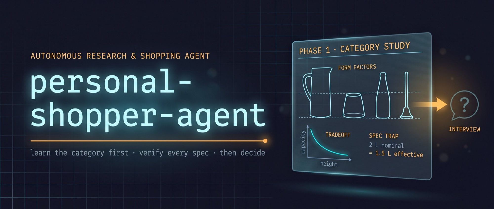

<p align="center">
  
</p>

# personal-shopper-agent

An autonomous personal shopper skill for [Claude Code](https://claude.com/claude-code).

It turns a vague purchasing wish into a small set of products *verified* to satisfy every
hard requirement, delivered as a self-contained interactive HTML report.

Two premises drive the whole design:

1. **You don't know how to shop in this category.** Which specs are differentiators,
   which are marketing noise, which sub-categories exist - acquiring that is the agent's
   job, and it does it *before* asking you anything.
2. **A spec that hasn't been verified from a primary source does not exist.** Retailer
   spec fields are routinely wrong. Every number is a claim until it is sourced.

## Install

Pick the row that matches where you use Claude.

| Where | How |
|---|---|
| Claude Code | `/plugin marketplace add sebastienfi/personal-shopper-agent` then `/plugin install shopper-agent@sebastienfi` |
| Cowork / Claude Desktop | Customize → Plugins → **Add marketplace** → `sebastienfi/personal-shopper-agent` → Install |
| claude.ai (no plugins) | Download [`shopper-agent.zip`][latest] → Customize → Skills → **+** → Create skill → upload → toggle on |
| Claude API | `POST /v1/skills` with the same `shopper-agent.zip` |

[latest]: https://github.com/sebastienfi/personal-shopper-agent/releases/latest

The `owner/repo` shorthand resolves over SSH where a GitHub key is configured. Without one,
pass the full HTTPS URL instead:

```
/plugin marketplace add https://github.com/sebastienfi/personal-shopper-agent.git
```

### Before it will work

The agent does live research and writes an interactive HTML report, so it needs:

- **Web search and web fetch.** On in Claude Code by default; on claude.ai check
  Settings → Capabilities.
- **Code execution and file creation.** Required for skills to run at all on claude.ai, and
  required here to write the report. Settings → Capabilities on Free/Pro/Max. Team plans
  have it on by default; on Enterprise an Owner enables **Code execution and file creation**
  and **Skills** under Organization settings → Skills.

Without these the skill will still trigger and then quietly underperform, so it is worth
confirming before the first run. Image acquisition also uses `curl` and, on macOS, `sips`.

### Updating

Claude Code and Cowork pull new versions from the marketplace - run
`/plugin marketplace update sebastienfi` if you want it now rather than at next launch.
Zip installs do not auto-update; re-download and re-upload.

## Use

```
/shopper-agent
```

Or just ask: *"find me a blender under 35 cm that does 1.5 L"*, *"what laptop should I buy
for X"*, *"help me choose between these two"*.

Then answer 3-4 questions and read the report.

## How it works

Seven phases, each gating the next.

| Phase | Name | Gate to pass |
|---|---|---|
| 1 | Domain primer | Can name the form factors, differentiating specs, and spec traps |
| 2 | Requirements interview | Every constraint has a provenance tag and a quantified value |
| 3 | Feasibility pre-check | The constraint set is known satisfiable, or reported as not |
| 4 | Research & acquisition | Candidate pool with primary-source specs and a lead image each |
| 5 | Verification & audit | Every candidate scored per constraint |
| 6 | Presentation | Interactive HTML report published |
| 7 | Iterative refinement | Constraint diff reported, pool re-audited, report updated in place |

### 1. Learn the category first

Research the *category*, not products: form factors and who each suits, the 3-5 specs that
actually predict satisfaction, the specs that look decisive and aren't, nominal-vs-effective
traps (a "2 L" jug has a 1.5 L working fill line), price bands, and what owners complain
about after six months.

Crucially it maps **which specs trade off against each other, and at what rate** - the input
that makes the next two phases possible. The primer is then reported back to you, because
that missing expertise is why you asked.

### 2. Derive requirements, don't request specs

You get asked about people, frequency, and context. The spec is computed from that, with the
arithmetic shown:

> Three adults, one serving each, 250-350 ml per serving, so 750-1050 ml. I will gate on 1 L.
> Correct me if your portions are larger.

Every constraint is tagged `stated_hard | stated_soft | user_estimate | derived`. A guess
(question marks, "maybe", "or") is **never gated on** - it gets re-derived from the use case
and confirmed. Locale constraints (mains voltage, plug type, market SKU suffix, import VAT
and duty) are derived from the shipping destination without being asked.

### 3. Check feasibility before searching

Constraint sets can be jointly unsatisfiable. Using the primer's tradeoff map, the two or
three most likely conflicting constraints are probed and the space bounded arithmetically,
then classified `SATISFIABLE | TIGHT | OVER_DETERMINED`.

If over-determined, the agent **stops and names the binding constraint** instead of searching
indefinitely. That's a finding, not a failure. Geometry also cuts the other way: it separates
"physically impossible" from "nobody builds it", which are different answers for you.

### 4. Research with a fetch fallback ladder

Retailer pages fail constantly (403, JS-rendered, truncated shells). When one rung fails, the
agent descends: manufacturer spec page or manual → `curl` with a browser user-agent →
manufacturer DAM/CDN → price aggregators → spec-sheet PDF → alternate-locale page for the
same SKU.

A failed fetch never becomes an assumed value. It becomes an entry in `unverified`. And
searching is budgeted: after three rounds with no new passing candidate, the agent delivers
what it has plus the binding-constraint analysis. A decision is the deliverable, not an
exhaustive search.

### 5. Deterministic, gating audit

Every candidate is scored per constraint as `PASS | PASS_MARGINAL | FAIL | UNKNOWN`, with
evidence, source tier, and computed margin recorded.

- Only candidates passing *every* hard constraint enter `verified_solutions`.
  **`UNKNOWN` excludes, exactly as `FAIL` does.**
- Threshold constraints carry a margin. A unit measuring exactly 35.0 cm against a 35 cm
  clearance technically passes and will not physically slide in - that's `PASS_MARGINAL`,
  not `PASS`.
- Sources are ranked: manufacturer spec sheet or manual > manufacturer page > measured
  review > retailer spec field > marketing copy > search snippet. **A hard constraint may
  never be decided by a retailer spec field alone.**
- Plausibility checks run on every gating figure (aspect ratio, sum of parts, volume vs
  dimensions, weight vs size). An implausible number is usually transposed axes or a carton
  dimension, not a remarkable product.
- Lead images are inspected and read back. They are evidence, not decoration: in one session
  a photo revealed a tamper (implying a lid opening, satisfying a hard constraint) and
  another confirmed an auto-clean program from the control-panel legend.

### 6. An interactive report, not a list

A single self-contained HTML file published as an Artifact - inline CSS/JS, images as `data:`
URIs, no external assets. It contains:

- **Headline finding** first, not a greeting
- **An interactive tool for the binding constraint** - drag the threshold, watch the field
  re-audit live. This turns "here is what qualifies" into "here is what your constraint costs
  you", which is the question you actually have
- **Verified solution cards** with lead image, spec table, margins, merchant links, and each
  one's *weakest point* (a card with no downside reads as advertising)
- **A near-miss panel** naming each product's exact unmet constraint
- **The full audit ledger** of every rejected candidate and its binding reason - user-facing,
  because it proves coverage and lets you overrule any exclusion
- Comparison modal, category usage guidance, and an explicit confidence disclosure of what
  could not be verified

### 7. Delta processing over re-research

Change a constraint and the existing pool is re-audited first, with an explicit diff and
impact statement: what changed, what now fails, what got promoted. No silent re-ranking.

Relaxing a constraint re-audits previously *failed* candidates rather than discarding them -
the pool is cumulative. New searches run only for the newly binding criteria, and only if
fewer than three verified solutions remain. The report republishes to the same URL, so you
keep one link.

## Design principles

- **Domain competence precedes the interview.** Never ask a specification question from a
  position of ignorance about the category.
- **Feasibility before search.** Detect the impossible request early and name the binding
  constraint.
- **Provenance over assertion.** A user's guess is not a requirement.
- **`UNKNOWN` excludes.** Unverifiable is not the same as acceptable.
- **Near-misses are surfaced, never hidden.** You may rationally overrule a constraint. You
  cannot overrule what was concealed.
- **The rejected-candidate ledger is a deliverable**, not an internal log.
- **Report the binding constraint, always.** When little survives, the binding-constraint
  analysis with a quantified relaxation payoff *is* the answer.

## Layout

```
.claude-plugin/marketplace.json           # catalog, one entry
plugins/shopper-agent/
├── .claude-plugin/plugin.json            # name, version, author
└── skills/shopper-agent/                 # the skill itself
    ├── SKILL.md                          # phase-gated behavioural spec, source of truth
    └── references/
        ├── domain-primer.md              # how to become competent in a category first
        ├── source-verification.md        # source tiers, conflict resolution, margins
        ├── image-sourcing.md             # lead images: acquisition, CSP, verification
        └── report-template.md            # HTML report anatomy and interaction patterns
.claude/skills/shopper-agent -> ../../plugins/shopper-agent/skills/shopper-agent
```

`SKILL.md` holds the authoritative phase sequence and stays scannable. The reference files
hold the detailed playbooks and are read on demand (progressive disclosure), each pointed to
from the phase that needs it.

The playbooks are grounded in real failures. `source-verification.md` carries a documented
catalogue: a blender listed as 26.5 cm tall that was actually 47.7 cm (carton dimensions in
scrambled order), a retailer advertising removable blades that the manufacturer's own asset
name confirmed were `NonDetachable`, the same product listed at both 2,500 and 25,000 RPM.
Each would have produced a wrong purchase.

## Working on it

The skill lives at `plugins/shopper-agent/skills/shopper-agent/`. Load that directory
directly rather than installing, and the working tree is the only copy on your machine:

```bash
alias cc='claude --plugin-dir /path/to/personal-shopper-agent/plugins/shopper-agent'
```

`cc` in any directory gets the live skill, and `/reload-plugins` picks up edits without a
restart.

**This works even with the plugin installed at user scope.** Installing copies a snapshot
into `~/.claude/plugins/cache/`, and a plain `claude` reads that snapshot, so your edits do
nothing. `--plugin-dir` shadows it: same plugin name, so the two dedupe to one entry and the
working tree wins. You get the released copy for everyday use and the live copy whenever you
launch with the flag.

What does *not* work is a `.claude/skills/shopper-agent` symlink in the repo. That loads as a
project skill named `shopper-agent`, while the installed plugin loads as
`shopper-agent:shopper-agent` - different names, so they never dedupe and you genuinely run
two copies. This repo deliberately has no such symlink.

Before tagging:

```bash
claude plugin validate . --strict
claude plugin validate ./plugins/shopper-agent --strict
```

`SKILL.md` is the source of truth for behaviour - change it there rather than duplicating
rules elsewhere. Detailed procedure belongs in `references/`. Keep the report single-file and
dependency-free so it renders standalone.

Tagging `v*` builds `shopper-agent.zip` (skill folder at the zip root) and attaches it to the
GitHub release. Bump the version in both `.claude-plugin/marketplace.json` and
`plugins/shopper-agent/.claude-plugin/plugin.json` - CI fails the build if they drift.

## License

CC0 1.0 Universal. Public domain, no attribution required.
